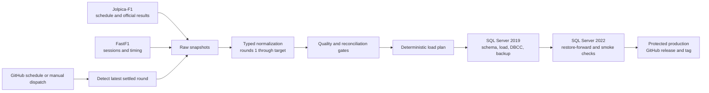

[](https://github.com/F1-SQL/F1-SQL/releases)
[](LICENSE)
[](https://github.com/F1-SQL/F1-SQL/releases)
[](https://github.com/F1-SQL/F1-SQL/stargazers)

# F1 SQL

F1 SQL is an unofficial, community-maintained project that builds a Microsoft
SQL Server database from openly accessible Formula One data. The software is
open source and the generated data releases are non-commercial and share-alike.

The project is maintained for education, demonstration, and community use. It
is not associated with Formula 1, the FIA, or their affiliated companies.

The automated release pipeline is operational. It detects the latest settled
round, builds a cumulative season-to-date database, verifies the database on
SQL Server 2019 and SQL Server 2022, and publishes an immutable GitHub release
only after every gate passes.

## How the system works



The release candidate is cumulative for the selected season. For example,
`2026.9.0` contains rounds 1 through 9 of the 2026 season; it is not just the
data from round 9. Earlier releases remain immutable snapshots.

### Source ownership

| Domain | Primary source | Secondary purpose |
| --- | --- | --- |
| Seasons, races, circuits | Jolpica-F1 | FastF1 schedule validation |
| Drivers, constructors, official results | Jolpica-F1 | FastF1 consistency checks |
| Sessions and actual session timing | FastF1 | Jolpica schedule comparison |
| Laps, sectors, speeds, tyres, stints | FastF1 | Jolpica validation where available |
| Detailed pit timing | FastF1 | Jolpica comparison |
| Weather, track status, race control | FastF1 | No Jolpica equivalent |

Unavailable optional FastF1 fields are recorded as coverage gaps. They do not
silently become fabricated values and do not block a release unless the field
is required for that release.

## Release automation

The workflow is [`.github/workflows/release.yml`](.github/workflows/release.yml).

### Scheduled releases

The scheduled workflow runs every Tuesday at 06:17 UTC. It asks Jolpica for the
current UTC season’s race calendar, considers races settled after the configured
settling period (24 hours by default), and selects the highest settled round
that is ready. A missed run therefore catches up to the latest available round.

The calendar is obtained from Jolpica; there is no manually maintained calendar
file in the release path.

### Manual releases

Use **Actions → F1 SQL release pipeline → Run workflow**:

| Input | Validation run | Production run |
| --- | --- | --- |
| Branch | `main` | `main` |
| Season | e.g. `2026` | e.g. `2026` |
| Run validation without publishing | checked | unchecked |
| Request publication after every gate | unchecked | checked |

A production run requires both `dry_run=false` and `publish=true`. Publication
also requires the protected `production` environment and the environment
variable:

```text
F1SQL_RELEASE_BUNDLE_READY=true
```

The publish job requests `contents: write` only after validation, backup, and
restore-forward verification. Required environment reviewers approve the final
publication step.

### Release names

Release names use:

```text
SEASON.ROUND.REVISION
```

Examples:

| Release | Meaning |
| --- | --- |
| `2026.9.0` | First release through round 9 of the 2026 season |
| `2026.9.1` | Immutable correction to the `2026.9.0` dataset or build |
| `2024.1.0` | First release through round 1 of the 2024 season |

The round is the newest round included in the cumulative database. A revision
is incremented for a correction; an existing tag and its assets are never
silently replaced.

## Release assets

The GitHub release contains the following project assets:

| Asset | Purpose |
| --- | --- |
| `database.bak` | Verified SQL Server backup built on SQL Server 2019 |
| `f1-sql-SEASON.ROUND.REVISION.zip` | Complete release bundle, including raw snapshots |
| `manifest.json` | Release version, repository SHA, schema path, source versions, and asset inventory |
| `checksums.sha256` | SHA-256 checksums for every bundle file |
| `normalized.json` | Source-neutral normalized records |
| `load-plan.json` | Deterministic structured database load plan |
| `load-plan.sql` | Executable SQL Server load plan |
| `quality-report.json` | Quality rules, coverage gaps, and reconciliation results |
| `release-notes.md` | Race/date description and cumulative roll-up explanation |
| `LICENSE-DATA`, `NOTICE`, `ATTRIBUTION.md` | Data licensing and source attribution |

GitHub also displays its automatic `Source code (zip)` and `Source code
(tar.gz)` assets. Those are repository snapshots, not database releases. For
normal use, download the F1 SQL release ZIP or `database.bak`.

## Runtime and support matrix

| Component | Supported runtime |
| --- | --- |
| Orchestration | Python 3.11+ (CI currently uses Python 3.11) |
| FastF1 | `>=3.8,<4` |
| SQL Server build and backup | SQL Server 2019 Developer container |
| Restore-forward verification | SQL Server 2022 Developer container |
| Local container execution | Docker with access to the Docker daemon |
| GitHub Actions runners | Ubuntu hosted runners |

The Python package also defines optional `sqlserver` dependencies for local
ODBC-based integrations. The CI containers use `sqlcmd` inside the SQL Server
images.

## Repository layout

This is a monorepo. The former `f1-sql-database` checkout is now preserved under
`database/`; workflows do not perform a second database checkout.

```text
f1-sql/
├── .github/workflows/
│   ├── release.yml                 # scheduled/manual build and publication
│   ├── python.yml                  # Python tests and schema validation
│   └── sqlserver.yml               # SQL Server 2019 and 2022 integration
├── database/
│   ├── schema/v2/                  # numbered, idempotent SQL Server DDL
│   ├── tests/                      # integration and release smoke SQL
│   ├── scripts/                    # legacy database utilities
│   └── docs/                       # schema and legacy-table documentation
├── src/f1sql/
│   ├── sources/                    # Jolpica and FastF1 adapters/models
│   ├── normalization.py            # source-neutral typed records
│   ├── pipeline.py                 # cumulative normalization and gates
│   ├── load_plan.py                # deterministic FK-safe load ordering
│   ├── quality.py                  # fail-closed data-quality rules
│   ├── release.py                  # manifests, checksums, deterministic ZIPs
│   ├── readiness.py                # settled-round and source fingerprint logic
│   └── sqlserver_mapping.py        # normalized rows to v2 SQL columns
├── scripts/
│   ├── build_live_candidate.py     # fetch season-to-date candidate
│   ├── package_candidate_release.py
│   ├── sqlserver_integration.sh    # SQL Server 2019 build/backup checks
│   └── sqlserver_restore_forward.sh # SQL Server 2022 restore checks
├── tests/                          # unit, source, pipeline, and workflow tests
├── docs/                           # architecture, operations, and policies
└── README.md
```

The authoritative schema path is `database/schema/v2`. Release manifests record
the monorepo commit and this schema path so a release can be reproduced without
a second repository.

## Local development and verification

Create an editable development environment:

```bash
python3 -m venv .venv
source .venv/bin/activate
python -m pip install -e '.[dev,fastf1,sqlserver]'
```

Run the software and static checks:

```bash
pytest -q
ruff check .
mypy src
```

Inspect settled-round readiness locally:

```bash
f1sql detect --season 2026
```

The detector reports every discovered round, its readiness status, and the
selected cumulative target. `f1sql init 2026.9.0` creates an isolated local
pipeline workspace for that target; the production workflow then performs the
source fetch, cumulative build, SQL Server verification, and publication.

Run the SQL Server 2019 integration path locally. Docker must be installed and
running:

```bash
export F1SQL_SQLSERVER_PASSWORD='use-a-disposable-local-password'
bash scripts/sqlserver_integration.sh
```

To load a generated candidate instead of the checked-in fixture, set
`F1SQL_LOAD_SQL` to its `candidate/load-plan.sql`. The integration script then
uses generic release smoke checks rather than fixture-specific row counts.

The standalone restore-forward check accepts a SQL Server backup:

```bash
export F1SQL_BACKUP_INPUT=/path/to/database.bak
export F1SQL_SQLSERVER_PASSWORD='use-a-disposable-local-password'
bash scripts/sqlserver_restore_forward.sh
```

## Architecture and operating documentation

* [Rebuild architecture](docs/architecture/0001-rebuild-architecture.md)
* [Source ownership and reconciliation](docs/architecture/0002-source-ownership.md)
* [Component-specific licensing](docs/architecture/0003-licensing.md)
* [Monorepo layout](docs/architecture/0004-monorepo-layout.md)
* [Release operations](docs/operations.md)
* [Release policy](docs/release-policy.md)
* [Pipeline contract](docs/pipeline.md)
* [Normalization units and tolerances](docs/normalization.md)
* [Historical coverage policy](docs/historical-coverage.md)
* [Legacy data provenance audit](docs/legacy-data-audit.md)
* [Database schema v2](database/schema/v2/README.md)
* [Master rebuild checklist](docs/rebuild-master-plan.md)

## Coverage and known limitations

* Jolpica provides the historical championship and official result coverage.
* Rich FastF1 timing is expected from 2018 onward; earlier sessions expose
  explicit limitations rather than invented timing data.
* High-frequency telemetry, continuous running position, and team radio are
  outside the current v2 scope.
* Optional provider gaps are recorded in `quality-report.json`.
* Every cumulative release is season-to-date. A cross-season historical
  backfill is a separate operation from the post-race release update.

## Licensing

This repository uses component-specific licences:

* software, workflows, and configuration: [Apache-2.0](LICENSE);
* documentation: [CC BY 4.0](LICENSE-DOCS); and
* downloaded, transformed, and released data: [CC BY-NC-SA 4.0](LICENSE-DATA).

See [ATTRIBUTION.md](ATTRIBUTION.md) and [NOTICE](NOTICE) for source and
trademark notices. The data licence applies to release assets even when the
software used to build them is Apache-2.0.

## Documentation and issues

Project documentation is published at [F1SQL.com](https://www.f1sql.com/).
Please report software defects and data-quality issues through the repository's
[issue tracker](https://github.com/F1-SQL/F1-SQL/issues).

## Image credit

Header photo by
[Chethan Kanakamurthy](https://unsplash.com/@chethan-kanakamurthy), from
[Unsplash](https://unsplash.com/photos/a-black-and-white-photo-of-a-racing-car-DAhUu3oe64I).
